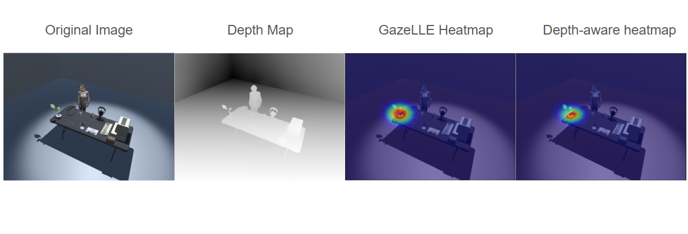
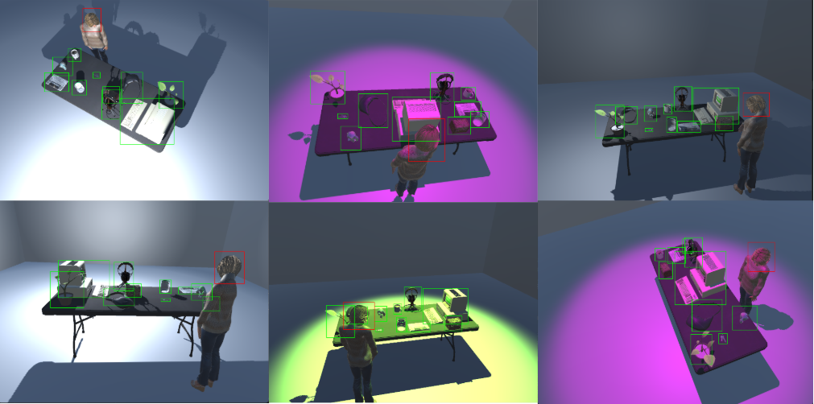

# Gaze Detection Final Year Project: DepthLLE

### Ryan et al's GazeLLE work can be found here: [GazeLLE](https://github.com/fkryan/gazelle)

This final year project focuses on depth estimation within gaze detection and how it affects model performance. A depth-aware heatmap approach was used, incorporating Depth Anything's depth maps into the heatmap, which eventually caused an increase from the original model's performance. Dataset Gaze Validation (GV) was created and used to add value to the testing process and compare depth-aware and non-depth-aware heatmap approaches. Only synthetic data was used for findings, and overfitting was tested using GV.

The code for the depth-aware heatmap can be found in utils.py, under the get_heatmap function.

AI tools were used to help the development process and were used on the basis of complete understanding of the output.  
- [Copilot](https://copilot.cloud.microsoft)
- [Claude](https://claude.ai/new)

Training loops used GOO-Synthetic dataset found here: [GOO-Synthetic](https://huggingface.co/datasets/markytools/goosyntheticv3)

## New Dataset

A validation dataset called Gaze Validation was also created with the purpose of testing model overfitting and how well it generalised to the data.

Dataset found here: [Dataset](https://github.com/Mango-Goose/Gaze-Dataset)

